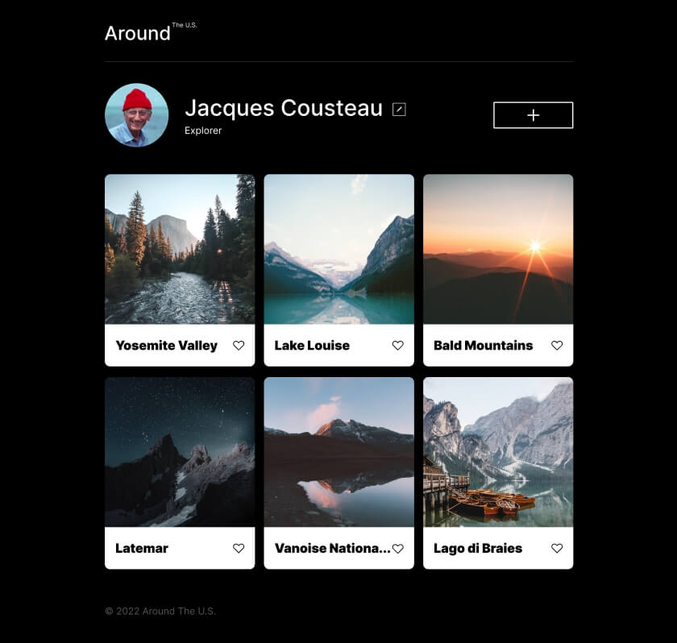
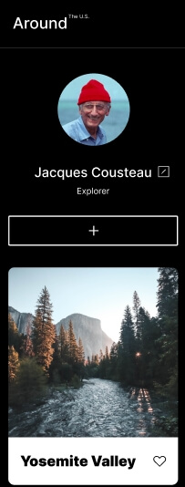

# Project 3: Around The U.S.

### Overview  

* Intro  
* Figma  
* Images  
  
**Intro**
  
This project is named "Around the U.S." for Triple Ten's Software Engineering program in Sprint 3. In this project, I learned how to implement different rules and properties to render multiple resolutuions for mobile devices, tablets, and desktops. 
  
**Figma**  
  
* [Link to the project on Figma](https://www.figma.com/file/ii4xxsJ0ghevUOcssTlHZv/Sprint-3%3A-Around-the-US?node-id=0%3A1)  

Github: https://github.com/jmwint/se_project_aroundtheus
  
**Images**  
  
https://drive.google.com/file/d/1p8qvuCBOwk-eYBTO3mihspfcr1EskC5t/view?usp=sharing

